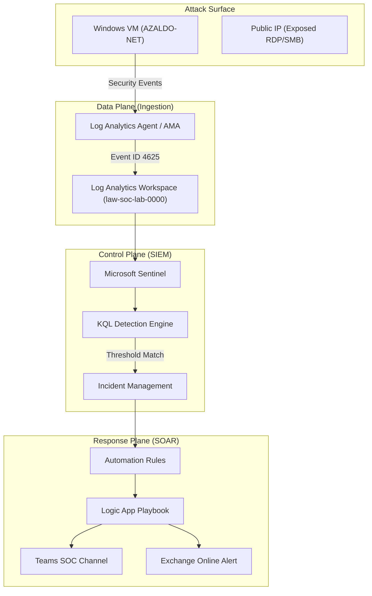

"
# 🛡️ Case Study: Architecting a Cloud-Native SOC with Azure Sentinel & Logic Apps
### *End-to-End Threat Detection, Geo-Visual Analysis, and Automated Incident Response*

---

## 📑 1. Executive Summary
In modern cloud environments, security teams are overwhelmed by "log noise." This project establishes a high-fidelity **Security Operations Center (SOC)** lab within Microsoft Azure, designed to solve the problem of manual triage. 

By leveraging **Microsoft Sentinel (SIEM)** and **Azure Logic Apps (SOAR)**, I constructed an autonomous pipeline that ingests raw telemetry from Windows endpoints, applies advanced detection logic via **Kusto Query Language (KQL)**, and executes deterministic response playbooks. The result is a system that transforms **1,000,000+ raw events** into a handful of actionable incidents, notified via Teams and Email in near real-time.

---

## 🏗️ 2. High-Level Architectural Design
The architecture is designed for **scalability** and **resiliency**, following the industry-standard "Collect, Detect, Investigate, and Respond" framework.



---

## 📡 3. Phase 1: Infrastructure & Telemetry Collection
### **3.1 The Vulnerable Target**
To generate real-world data, I deployed a **Windows 10 Pro VM (`AZALDO-NET`)** with its Network Security Group (NSG) intentionally configured to allow inbound traffic on common management ports (3389/445). This "Honey-pot" approach ensured a constant stream of global brute-force telemetry.

### **3.2 The Pipeline**
- **Log Analytics Workspace (LAW)**: Acts as the central data lake. All raw logs are stored here with a custom retention policy.
- **Data Collection**: I utilized the **Azure Monitor Agent (AMA)** to target specific security event streams, specifically the `SecurityEvent` table.

---

## 🧠 4. Phase 2: Detection Engineering (The KQL Brain)
The core value of this lab lies in the **Analytics Rule**. Simple alerting on Event ID 4625 is too noisy. Instead, I developed a sophisticated detection logic that focuses on **Persistence** and **Volume**.

### **KQL Technical Breakdown:**
```kql
SecurityEvent
| where EventID == 4625 // Filter for Failed Logons
| where IpAddress != \"\" // Exclude internal system noise
| summarize 
    StartTime = min(TimeGenerated), 
    EndTime = max(TimeGenerated), 
    FailedAttempts = count() 
    by Account, IpAddress, Computer
| where FailedAttempts > 15 // High-confidence threshold
| extend 
    AccountCustomEntity = Account, 
    IPCustomEntity = IpAddress, 
    HostCustomEntity = Computer
```

**Why this logic works:**
1.  **Summarization**: It groups attacks by attacker IP and target account, creating a single "story" for each brute-force campaign.
2.  **Thresholding**: By setting the limit to `> 15`, we ignore minor user errors and catch automated tools (Hydra, Medusa, etc.).
3.  **Entity Mapping**: Crucial for SOAR. By defining `IPCustomEntity`, Microsoft Sentinel passes the attacker's IP as a **variable** to our Logic App.

---

## 🛡️ 5. Phase 3: MITRE ATT&CK® Mapping
This lab isn't just "detecting stuff"—it's aligned with the global framework for threat actor behavior.

| Tactic | Technique | ID | Mitigation |
| :--- | :--- | :--- | :--- |
| **Credential Access** | Brute Force | T1110 | Sentinel Detection + Automated Blocking |
| **Initial Access** | Valid Accounts | T1078 | Real-time monitoring of failed attempts |
| **Reconnaissance** | Active Scanning | T1595 | Attack Map Visualization |

---

## 🤖 6. Phase 4: SOAR Orchestration (Logic Apps)
When an incident is created, the **Automation Rule** (the "Switchboard") routes the incident to my custom **Logic App Playbook**.

### **Playbook Logic Flow:**
1.  **Trigger**: `When a Microsoft Sentinel incident is created`.
2.  **Entity Extraction**: The playbook parses the JSON output of the incident to find the `IP` entity.
3.  **Contextual Notification (Teams)**:
    - **Adaptive Card**: Sends a formatted card to the `#SOC-LAB` channel. 
    - **Details included**: Incident Name, Severity, Attacker IP, and a deep link to the Sentinel Investigation Graph.
4.  **Executive Notification (Email)**: Sends a formal V2 Outlook email for archival and high-level management visibility.

---

## 🗺️ 7. Phase 5: Visual Analysis (The Global Attack Map)
To provide executive-level visibility, I designed a **Sentinel Workbook** that maps the `IpAddress` from the `SecurityEvent` table to geographic coordinates.

### **Insights from the Data:**
- **Volume**: The lab processed **~1,000,000+ failed logons** in a 24-hour window.
- **Top Origin**: Glendora, USA (263,000+ attempts) followed by Braga, Portugal.
- **Utility**: This visualization allows analysts to identify "Hot Zones" and adjust NSG/Firewall rules based on geographic risk (Geo-Blocking).

---

## 🕵️ 8. Analyst Workflow: The Triage Experience
In a real-world SOC, the workflow enabled by this lab looks like this:
1.  **09:00:05**: Attacker in the Netherlands starts a brute-force script.
2.  **09:05:00**: KQL Rule detects 50 failures in 5 minutes; Incident #856 is created.
3.  **09:05:02**: Logic App triggers; Teams channel "pings" the analyst.
4.  **09:05:10**: Analyst sees the alert, clicks the link, and views the **Investigation Graph** to see if the attacker succeeded on other machines.
5.  **09:06:00**: Incident is closed/remediated.

---

## 🛠️ 9. Challenges & Technical Solutions
- **Challenge**: Initial KQL was too sensitive, triggering on legitimate admin mistakes.
- **Solution**: Increased the threshold and implemented a `bin(TimeGenerated, 5m)` to look for bursts of activity rather than sustained low-and-slow noise.
- **Challenge**: Extracting IP entities from Logic Apps can be tricky due to JSON nesting.
- **Solution**: Used the `Entities - Get IPs` native Sentinel connector in Logic Apps for clean data parsing.

---

## 🔮 10. Future Roadmap
- [ ] **Threat Intel Integration**: Automatically query **AbuseIPDB** or **VirusTotal** within the Logic App to see if the IP is already known as malicious.
- [ ] **Automated Containment**: Add an "Approval" step in Teams; if the analyst clicks "Block," the Logic App automatically updates the Azure NSG to deny the IP.
- [ ] **Honey-Token Implementation**: Create a fake "Administrator" account with a 64-character password to trigger high-severity alerts.

